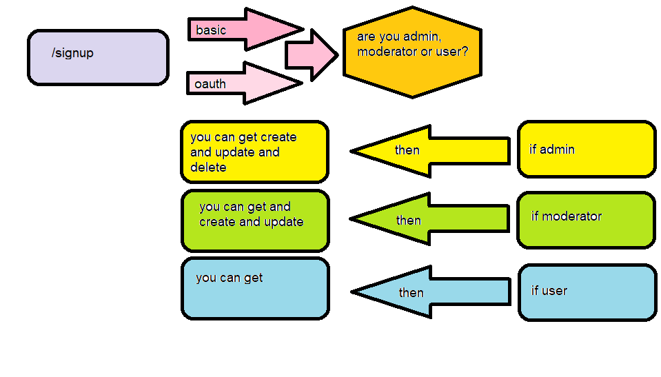

# LAB - Class 15

## Authenticated-Api-Server

### Author: obada alquran

### Links and Resources

- [submission PR](https://github.com/obadeh/authenticated-api-server/pull/1)
- [ci/cd](http://xyz.com) (GitHub Actions)

### Setup

#### `.env` requirements (where applicable)

i.e.

- `PORT` - 3000
- `MONGODB_URI` - mongodb://localhost:27017/lab-11
- `SECRET`=obadaSECRET
- `CLIENT_ID`=24c1459df95fbe821cf7
- `CLIENT_SECRET`=dab712a3d0a986373e25672e8e785fe65cef3e70
- `API_SERVER`=http://localhost:3000/oauth

#### How to initialize/run your application (where applicable)

- e.g. `npm start`

#### Tests

- How do you run tests? `npm test`
- Any tests of note?
- Describe any tests that you did not complete, skipped, etc

#### UML

